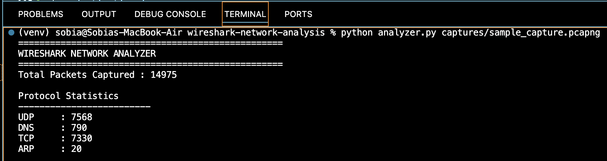
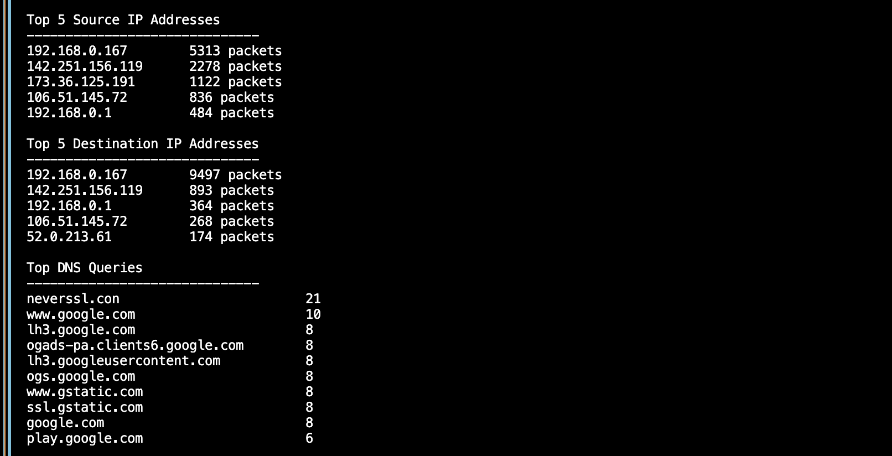
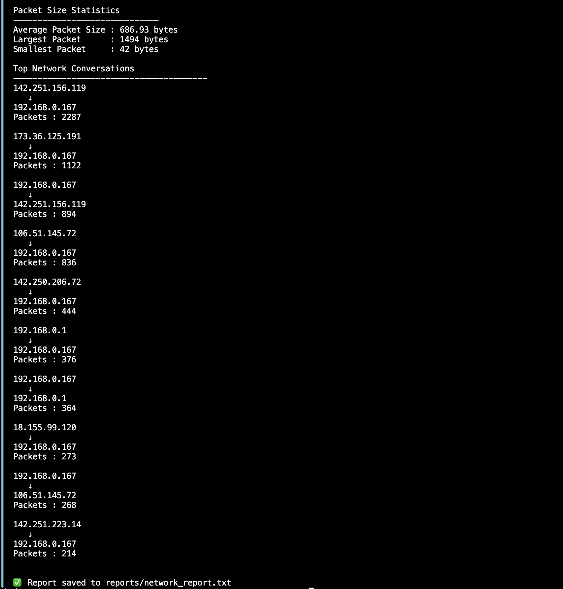
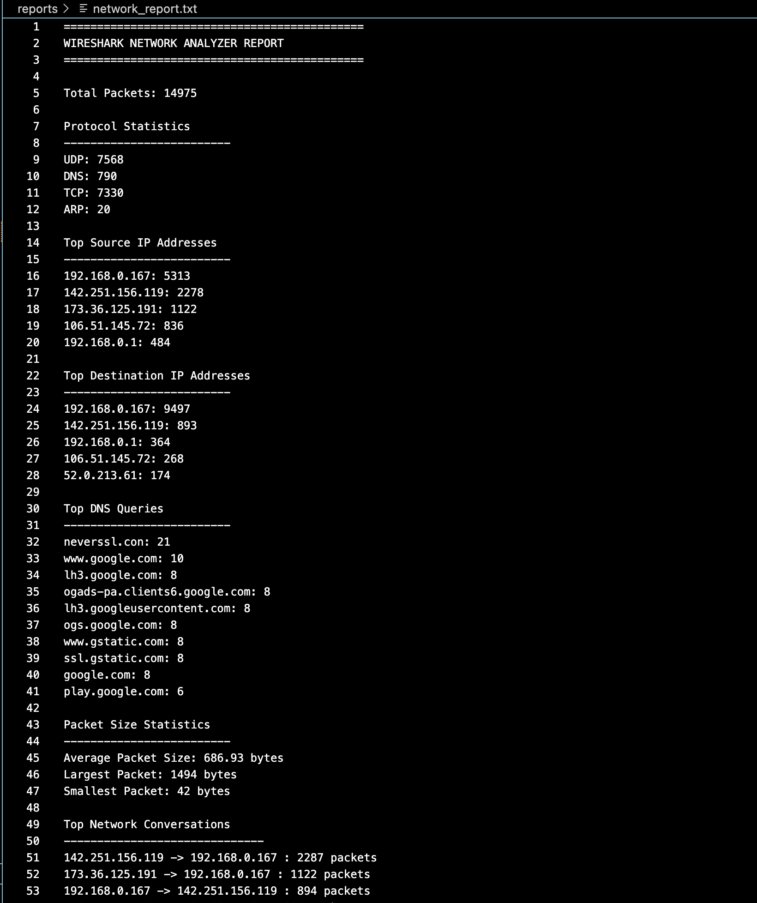

# Wireshark Network Analyzer

A Python-based command-line network packet analyzer that processes Wireshark PCAP/PCAPNG capture files using Scapy and generates detailed network traffic reports.

---


## Features

- Analyze PCAP and PCAPNG files
- Protocol statistics (TCP, UDP, DNS, ARP)
- Top source and destination IP analysis
- DNS query extraction
- Packet size statistics
- Network conversation analysis
- Automatic report generation
- Command-line support for analyzing any capture file

---

## Technologies Used

- Python 3
- Scapy
- Wireshark
- Git
- VS Code

---

## Project Structure

```text
wireshark-network-analysis/
├── captures/
├── network/
├── reports/
├── screenshots/
├── analyzer.py
├── requirements.txt
└── README.md
```

---

## Installation

Clone the repository

```bash
git clone <your-repository-url>
```

Create a virtual environment

```bash
python3 -m venv venv
```

Activate it

macOS/Linux

```bash
source venv/bin/activate
```

Install dependencies

```bash
pip install -r requirements.txt
```

---

## Usage

Analyze a capture file

```bash
python analyzer.py captures/sample_capture.pcapng
```

A detailed report will automatically be generated inside the `reports` folder.

---

## Sample Output

### Console Output







---

### Generated Report



---

## Future Improvements

- Port-wise traffic analysis
- Interactive dashboard
- CSV export
- Protocol filtering
- Live packet capture analysis

---

## Learning Outcomes

This project strengthened my understanding of:

- TCP/IP networking
- Packet analysis
- DNS protocol
- Client-server communication
- Python modular programming
- Command-line application development
- Git version control# wireshark-network-analysis